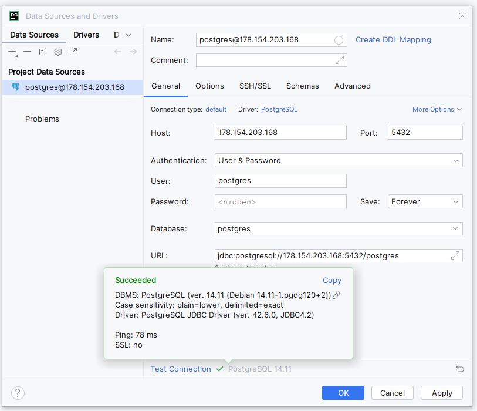
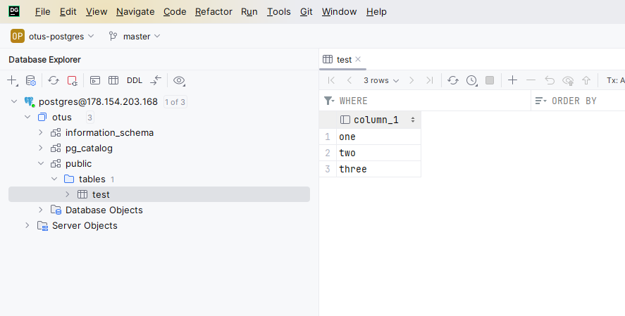

# ДЗ 02. Установка и настройка PostgreSQL в контейнере Docker (по лекции 03.  Установка PostgreSQL)

Все операции проводил на машине с системой Windows через [PowerShell 7.4.1](https://learn.microsoft.com/en-us/powershell/scripting/install/installing-powershell-on-windows?view=powershell-7.4) с использованием виртуальной машины на [Yandex Cloud](https://console.cloud.yandex.ru/). Для подключения по **ssh** использовался пакет [OpenSSH for Windows](https://learn.microsoft.com/en-us/windows-server/administration/openssh/openssh_install_firstuse?tabs=gui).

<details>
   <summary><h3>Условные обозначения</h3></summary>

   #### 1. Выполнение команд на локальной машине в PowerShell
   

   ```powershell
   PS local> do-something
   ```

   #### 2. Выполнение команд в рамках SSH-сессии на виртуальной машине
   

   ```bash
   vm:~$ do-something
   ```

   #### 3. Выполнение команд в утилите psql
   

   ```
   postgres# \l
   ```

</details>


## I. Подготовка виртуальной машины на Yandex Cloud

1. С использованием утилиты [PuTTYgen](https://www.puttygen.com/) и инструкции [How to Create SSH Keys with PuTTY on Windows](https://docs.digitalocean.com/products/droplets/how-to/add-ssh-keys/create-with-putty/) сгенерировал пару ssh-ключей, которые сохранились как стандартная пара ключей `<Папка пользователя>/.ssh/id_rsa` и `<Папка пользователя>/.ssh/id_rsa.pub`, которую и будем использовать для работы с Yandex Cloud CLI.
2. Запустил терминал PowerShell и согласно [инструкции из документации Yandex Cloud](https://cloud.yandex.com/en/docs/cli/quickstart#windows_1) установил утилиты Yandex Cloud CLI с использованием команды

    

       PS local> iex (New-Object System.Net.WebClient).DownloadString('https://storage.yandexcloud.net/yandexcloud-yc/install.ps1')

3. <a name="i_3"></a>Создал в Yandex Cloud подсеть и сеть командами

    

       PS local> yc vpc network create --name otus-net --description "net for otus postgres training"
       PS local> yc vpc subnet create --name otus-subnet --range 192.168.0.0/24 --network-name otus-net --description "otus-subnet"

4. Создал виртуальную машину в YC. По какой-то причине утилита `yc` не увидела путь `~/.ssh`. Возможно, дело в том, что это Windows версия и она ожидала параметра вида `%userprofile%`. Однако, не стал с этим долго разбираться, перешёл в папку пользователя и оттуда выполнил команду для создания [прерываемой](https://cloud.yandex.com/ru/docs/compute/concepts/preemptible-vm) виртуальной машины в подсети из [пункта 3](#i_3) с 2 ядрами процессора, 4ГБ оперативной памяти и диском HDD на 15ГБ, куда предустановлена **ubuntu 22.04.3 LTS**

   

       PS local> yc compute instance create --preemptible `
           --name otus-vm-03 `
           --hostname otus-vm-03 `
           --cores 2 --memory 4 `
           --create-boot-disk size=15G,type=network-hdd,image-folder-id=standard-images,image-family=ubuntu-2004-lts `
           --network-interface subnet-name=otus-subnet,nat-ip-version=ipv4 `
           --ssh-key .\.ssh\id_rsa.pub

5. Просмотрел список запущенных виртуальных машин, чтобы узнать публичный IP адрес созданной машины и подключился к ней по SSH (с использованием ключа по умолчанию `~\.ssh\id_rsa`)

   

       PS local> yc compute instance list
       +----------------------+------------+---------------+---------+-----------------+--------------+
       |          ID          |    NAME    |    ZONE ID    | STATUS  |   EXTERNAL IP   | INTERNAL IP  |
       +----------------------+------------+---------------+---------+-----------------+--------------+
       | fhmr8kaso56g6hs0ncc9 | otus-vm-03 | ru-central1-a | RUNNING | 178.154.220.123 | 192.168.0.23 |
       +----------------------+------------+---------------+---------+-----------------+--------------+

       PS local> ssh yc-user@178.154.220.123

## II. Подготовка конфигурации для Docker

6. На виртуальной машине установил Docker с использованием [скрипта для тестового окружения](https://docs.docker.com/engine/install/ubuntu/#install-using-the-convenience-script)

   

       vm:~$ curl -fsSL https://get.docker.com -o get-docker.sh && sudo sh get-docker.sh && rm get-docker.sh

7. Добавил текущего пользователя к группе `docker` для возможности управления контейнерами без необходимости входить в режим `super user` и сразу же обновил конфигурацию группы командой `newgrp`, чтобы не было необходимости в перезагрузке виртуальной машины

   

       vm:~$ sudo usermod -aG docker $USER && newgrp docker

8. <a name="ii_8"></a> Создал папку на виртуальной машине для последующего хранения файлов PostgreSQL

   

       vm:~$ sudo mkdir /var/lib/postgresql

9. <a name="ii_9"></a>В локальном редакторе подготовил 3 файла

   <details>
      <summary><b>pg-client.dockerfile</b> - докер-файл для сборки контейнера, куда установлена только утилита <b>psql</b></summary>

      [Ссылка на файл pg-client.dockerfile](pg-client.dockerfile)
      ```dockerfile
      FROM alpine:3.19
      RUN apk --no-cache add postgresql14-client
      ENTRYPOINT [ "psql" ]
      ```

   </details>

   <details>
      <summary><b>docker-compose.yaml</b> - файл для утилиты <b>docker-compose</b> с описанием двух контейнеров: один с СУБД PostgreSQL и второй с утилитой <b>psql</b></summary>

      [Ссылка на файл docker-compose.yaml](docker-compose.yaml)
      ```docker-compose
      version: '3.9'
         services:
            pg-server-14:
               container_name: ${PGHOST}
               image: postgres:14
               restart: always
               environment:
                  POSTGRES_PASSWORD: ${PGPASSWORD}
               ports:
                  - 5432:5432
               volumes:
                  - /var/lib/postgresql:/var/lib/postgresql/data

            pg-client:
               environment:
                  PGDATABASE: postgres
                  PGHOST: ${PGHOST}
                  PGPORT: 5432
                  PGUSER: postgres
                  PGPASSWORD: ${PGPASSWORD}
               build:
                  context: .
                  dockerfile: pg-client.dockerfile
               restart: no
      ```

   </details>

   <details>
      <summary><b>.env</b> - файл с паролем и именем контейнера с СУБД, которые вынесли в константы окружения для удобства запуска <b>docker-compose</b></summary>

      [Ссылка на файл .env](.env)
      ```env
      PGHOST=pg-server-14
      PGPASSWORD=TheStrongPassword123
      ```

   </details>

10. На виртуальной машине создал отдельную папку для подготовленных файлов

    

        vm:~$ mkdir pg-install

11. С использованием утилиты **scp**, которая входит в пакет [OpenSSH for Windows](https://learn.microsoft.com/en-us/windows-server/administration/openssh/openssh_install_firstuse?tabs=gui), скопировал подготовленные на [шаге 9](#ii_9) файлы на виртуальную машину

    

        PS local> scp ./pg-install/* yc-user@84.201.132.197:/home/yc-user/pg-install

## III. Работа с PostgreSQL в Docker

12. Перешёл в папку `pg-install` и запустил контейнер с кластером PostgreSQL в фоновом режиме без подключения к его терминалу

    

        vm:~$ cd pg-install
        vm:~/pg-install$ docker compose up pg-server-14 -d

13. Проверил, что контейнер с кластером PostgreSQL с именем `pg-server-14` запустился корректно

    

        vm:~/pg-install$ docker ps -a
        CONTAINER ID   IMAGE         COMMAND                  CREATED         STATUS         PORTS                                       NAMES
        0235a22b8ec5   postgres:14   "docker-entrypoint.s…"   9 minutes ago   Up 9 minutes   0.0.0.0:5432->5432/tcp, :::5432->5432/tcp   pg-server-14

14. Запустил контейнер с утилитой `psql` в интерактивном режиме (ключ `-i`) и с ключом `--rm` для удаления контейнера после его остановки

    

        vm:~/pg-install$ docker compose run -i --rm pg-client

15. В открывшейся сессии **psql** создал базу данных с именем `otus` и таблицу `test` в ней. В таблицу вставил несколько тестовых записей

     

        postgres=# CREATE DATABASE otus;
        CREATE DATABASE

        postgres=# \l
                                 List of databases
        Name    |  Owner   | Encoding |  Collate   |   Ctype    |   Access privileges
        -----------+----------+----------+------------+------------+-----------------------
        otus      | postgres | UTF8     | en_US.utf8 | en_US.utf8 |
        postgres  | postgres | UTF8     | en_US.utf8 | en_US.utf8 |
        template0 | postgres | UTF8     | en_US.utf8 | en_US.utf8 | =c/postgres          +
                  |          |          |            |            | postgres=CTc/postgres
        template1 | postgres | UTF8     | en_US.utf8 | en_US.utf8 | =c/postgres          +
                  |          |          |            |            | postgres=CTc/postgres
        (4 rows)

        postgres=# \c otus
        You are now connected to database "otus" as user "postgres".

        otus=# CREATE TABLE test (column_1 varchar(100));
        CREATE TABLE
        otus=# INSERT INTO test (column_1) VALUES ('one'), ('two'), ('three');
        INSERT 0 3
        otus=# select * from test;
        column_1
        ----------
        one
        two
        three
        (3 rows)

16. На локальной машине запустил **DataGrip** и создал там подключение к кластеру, развернутому на Yandex Cloud, с использованием имени пользователя `postgres` и пароля из файла [.env](.env)
    

17. Подключился к созданной ранее БД `otus` и запросил данные из таблицы `test`
     

18. Чтобы проверить, что всю информацию наш кластер хранит в примонтированной на [шаге 9](#ii_9) директории [`/var/lib/postgresql`](##ii_2), остановил и удалил контейнер с кластером PostgreSQL

     

        vm:~/pg-install$ docker stop pg-server-14 && docker rm pg-server-14
        vm:~/pg-install$ docker ps -a
        CONTAINER ID   IMAGE         COMMAND                  CREATED         STATUS         PORTS                                       NAMES

19. Занового запустил контейнер с кластером PostgreSQL

     

        vm:~/pg-install$ docker compose up pg-server-14 -d

        vm:~/pg-install$ docker ps -a
        CONTAINER ID   IMAGE         COMMAND                  CREATED         STATUS         PORTS                                       NAMES
        9e2ef5ffb2e9   postgres:14   "docker-entrypoint.s…"   3 seconds ago   Up 3 seconds   0.0.0.0:5432->5432/tcp, :::5432->5432/tcp   pg-server-14

20. Снова запустил контейнер с утилитой `psql` в интерактивном режиме

     

        vm:~/pg-install$ docker compose run -i --rm pg-client

21. В открывшейся сессии **psql** подключился к БД `otus` и проверил наличие данных в таблице `test`

     

        postgres=# \l
                                 List of databases
        Name    |  Owner   | Encoding |  Collate   |   Ctype    |   Access privileges
        -----------+----------+----------+------------+------------+-----------------------
        otus      | postgres | UTF8     | en_US.utf8 | en_US.utf8 |
        postgres  | postgres | UTF8     | en_US.utf8 | en_US.utf8 |
        template0 | postgres | UTF8     | en_US.utf8 | en_US.utf8 | =c/postgres          +
                  |          |          |            |            | postgres=CTc/postgres
        template1 | postgres | UTF8     | en_US.utf8 | en_US.utf8 | =c/postgres          +
                  |          |          |            |            | postgres=CTc/postgres
        (4 rows)

        postgres=# \c otus
        You are now connected to database "otus" as user "postgres".

        otus=# select * from test;
        column_1
        ----------
        one
        two
        three
        (3 rows)

     Убедились, что данные действительно пережили удаления контейнера с кластером PostgreSQL!
