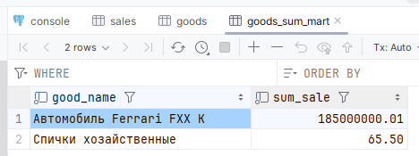
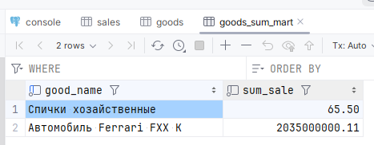
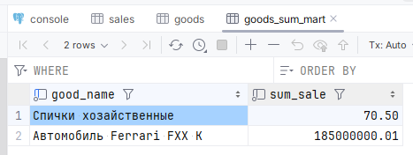
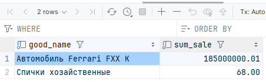
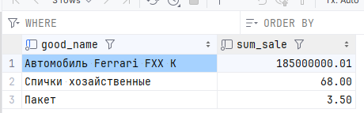

# ДЗ 14. Триггеры, поддержка заполнения витрин (по лекциям 20-22. Хранимые функции и процедуры)

Создал виртуальную машину **otus-vm-14** в Yandex Cloud согласно [инструкции](../00.Common/01.YC_start.md). Версию PostgreSQL для установки выбираем **14**. Все скрипты указанные ниже в тексте задания выполняются в менеджере для работы с базами данных (в моём случае DataGrip) в сессии подключенной к БД, настроенной на виртуальной машине в Yandex Cloud.

## 1. Подготовка БД к выполнению задания

**1.1** Создаем основные таблицы товаров и продаж и наполняем их, используя скрипты в задании:

```sql
DROP SCHEMA IF EXISTS pract_functions CASCADE;
CREATE SCHEMA pract_functions;
SET search_path = pract_functions, public;

-- Товары
CREATE TABLE goods
(
    goods_id    integer PRIMARY KEY,
    good_name   varchar(63) NOT NULL,
    good_price  numeric(12, 2) NOT NULL CHECK (good_price > 0.0)
);
INSERT INTO goods (goods_id, good_name, good_price)
VALUES  (1, 'Спички хозайственные', .50),
        (2, 'Автомобиль Ferrari FXX K', 185000000.01);

-- Продажи
CREATE TABLE sales
(
    sales_id    integer GENERATED ALWAYS AS IDENTITY PRIMARY KEY,
    good_id     integer REFERENCES goods (goods_id),
    sales_time  timestamp with time zone DEFAULT now(),
    sales_qty   integer CHECK (sales_qty > 0)
);

INSERT INTO sales (good_id, sales_qty) VALUES (1, 10), (1, 1), (1, 120), (2, 1);
```

**1.2** Создаем таблицу-витрину из скриптов в задании и наполняем её начальными данными:

```sql
DROP TABLE IF EXISTS pract_functions.goods_sum_mart;
CREATE TABLE pract_functions.goods_sum_mart
(
    good_name   varchar(63) NOT NULL,
    sum_sale    numeric(16, 2) NOT NULL
);

INSERT INTO pract_functions.goods_sum_mart (good_name, sum_sale)
SELECT G.good_name, sum(G.good_price * S.sales_qty)
FROM pract_functions.goods AS G
    INNER JOIN pract_functions.sales AS S ON S.good_id = G.goods_id
GROUP BY G.good_name;
```

**1.3** Проверим содержимое таблицы `goods_sum_mart` и убедимся, что данные заполнились корректно:



**1.4** Создадим триггерную функцию и добавим триггер к таблице `sales`, который будет вызывать нашу триггерную функцию ПОСЛЕ операций ДОБАВЛЕНИЯ, УДАЛЕНИЯ и ИЗМЕНЕНИЯ для КАЖДОЙ строки таблицы (мы предполагаем, что идёт OLTP нагрузка и больших пакетных изменений в БД на таблицу `sales` не идёт):

```sql
CREATE OR REPLACE FUNCTION tr_fill_goods_sum_mart()
    RETURNS trigger
AS
$tr_fill_goods_sum_mart$
DECLARE
    v_sale_to_add_sum          numeric(16, 2);
    v_sale_to_add_good_name    varchar(63);
    v_sale_to_remove_sum       numeric(16, 2);
    v_sale_to_remove_good_name varchar(63);
BEGIN
    RAISE NOTICE 'tr_fill_goods_sum_mart: triggered by (% %) operation for "%" table at % level', TG_WHEN, TG_OP, TG_TABLE_NAME, TG_LEVEL;

    IF TG_OP IN ('INSERT', 'UPDATE') THEN
        SELECT G.good_name, (new.sales_qty * G.good_price)
        INTO v_sale_to_add_good_name, v_sale_to_add_sum
        FROM pract_functions.goods AS G
        WHERE G.goods_id = new.good_id;

        RAISE NOTICE 'tr_fill_goods_sum_mart: going to add $% to good "%" row', v_sale_to_add_sum, v_sale_to_add_good_name;

        INSERT INTO pract_functions.goods_sum_mart AS M (good_name, sum_sale)
        VALUES (v_sale_to_add_good_name, v_sale_to_add_sum)
        ON CONFLICT (good_name) DO UPDATE
            SET sum_sale = M.sum_sale + excluded.sum_sale;
    END IF;

    IF TG_OP IN ('DELETE', 'UPDATE') THEN
        SELECT G.good_name, (old.sales_qty * G.good_price)
        INTO v_sale_to_remove_good_name, v_sale_to_remove_sum
        FROM pract_functions.goods AS G
        WHERE G.goods_id = old.good_id;

        RAISE NOTICE 'tr_fill_goods_sum_mart: going to deduct $% from good "%" row', v_sale_to_remove_sum, v_sale_to_remove_good_name;

        UPDATE pract_functions.goods_sum_mart AS M
        SET sum_sale = sum_sale - v_sale_to_remove_sum
        WHERE M.good_name = v_sale_to_remove_good_name;
    END IF;

    RETURN NULL;
END
$tr_fill_goods_sum_mart$
    LANGUAGE plpgsql
    SET search_path = pract_functions, public
    SECURITY DEFINER;

DROP TRIGGER IF EXISTS sales_fill_goods_sum_mart ON pract_functions.sales;
CREATE TRIGGER sales_fill_goods_sum_mart
    AFTER INSERT OR UPDATE OR DELETE
    ON pract_functions.sales
    FOR EACH ROW
EXECUTE FUNCTION tr_fill_goods_sum_mart();
```

В коде функции реализовали логику из двух шагов:

1. Если были строки на добавление (выполняется команда UPDATE или INSERT), то мы пытаемся добавить новую строку для товара со вставленным значением покупки. Если же строка уже существует, то добавляем сумму нашей новой покупки к ней.
2. Если были строки на удаление (выполняется команда UPDATE или DELETE), то мы ищем строку соответствующего товара в таблице-витрине и отнимаем от него сумму "покупки", которая была удалена/изменена.

> [!NOTE]
>
> 1. Данная реализация позволяет обрабатывать все изменения в таблице продаж: как изменение количества в строке покупки, так и изменение типа товара;
> 2. Данная реализация не предусматривает корректной обработки ситуаций, когда в таблице товаров были какие-либо изменения цены: у нас не обработан сценарий, когда цена на товар поменялась, а после этого изменили какую-либо из строк в таблице `sales`, ведь мы будем "отнимать" для удаленных значений не старую цену, по которой мы записали информацию в нашу витрину, но уже новую и всё поедет.

**1.5** Попробуем внести какие-либо изменения в таблицу `sales` и получим ошибку с текстом вида:

```sql
[2024-05-04 22:30:25] [42P10] ERROR: there is no unique or exclusion constraint matching the ON CONFLICT specification
[2024-05-04 22:30:25] Где: SQL statement "INSERT INTO ...
[2024-05-04 22:30:25] ON CONFLICT (good_name) DO UPDATE..."
[2024-05-04 22:30:25] PL/pgSQL function tr_fill_goods_sum_mart() line 18 at SQL statement
```

Видим, что для использования конструкции `INSERT ... ON CONFLICT` нам необходимо создать уникальный индекс для условия сопоставления.

**1.6** Добавим уникальный индекс на столбец `good_name` в таблицу-витрину:

```sql
CREATE UNIQUE INDEX IF NOT EXISTS ak_goods_sum_mart_good_name ON pract_functions.goods_sum_mart (good_name);
```

**1.7** Попробуем снова добавить новую строку с продажей 10 машин Феррари:

```sql
INSERT INTO pract_functions.sales (good_id, sales_time, sales_qty) VALUES (2, '2024-05-05 00:57:41.566000 +00:00', 10);

tr_fill_goods_sum_mart: triggered by (AFTER INSERT) operation for "sales" table at ROW level
tr_fill_goods_sum_mart: going to add $1850000000.10 to good "Автомобиль Ferrari FXX K" row
```

Проверим содержимое таблицы-витрины



**1.8** Попробуем в новой строке изменить значение товара с Феррари на спички:

```sql
UPDATE pract_functions.sales SET good_id = 1 WHERE sales_id = 11;

tr_fill_goods_sum_mart: triggered by (AFTER UPDATE) operation for "sales" table at ROW level
tr_fill_goods_sum_mart: going to add $5.00 to good "Спички хозайственные" row
tr_fill_goods_sum_mart: going to deduct $1850000000.10 from good "Автомобиль Ferrari FXX K" row
```

Проверим содержимое таблицы-витрины



**1.9** Изменим в нашей новой строке количество коробков спичек с 10 до 5:

```sql
UPDATE pract_functions.sales SET sales_qty = 5 WHERE sales_id = 11;

tr_fill_goods_sum_mart: triggered by (AFTER UPDATE) operation for "sales" table at ROW level
tr_fill_goods_sum_mart: going to add $2.50 to good "Спички хозайственные" row
tr_fill_goods_sum_mart: going to deduct $5.00 from good "Спички хозайственные" row
```

Проверим содержимое таблицы-витрины



**1.10** Добавим новый товар и создадим покупку для него:

```sql
INSERT INTO pract_functions.goods (goods_id, good_name, good_price) VALUES (3, 'Пакет', 3.50);
INSERT INTO pract_functions.sales (good_id, sales_time, sales_qty) VALUES (3, '2024-05-05 01:05:08.723000 +00:00', 1);

tr_fill_goods_sum_mart: triggered by (AFTER INSERT) operation for "sales" table at ROW level
tr_fill_goods_sum_mart: going to add $3.50 to good "Пакет" row
```

Проверим содержимое таблицы-витрины



## 2. Мысли по поводу преимуществ витрины перед отчетом в виде запроса или представления

Вопрос: **Чем такая схема (витрина+триггер) предпочтительнее отчета, создаваемого "по требованию" (кроме производительности)?
*Подсказка: В реальной жизни возможны изменения цен.***

Судя по подсказке, схема витрина+триггер должна помочь нам получить правильный результат в отчете даже при смене цены товара, чего сложнее достичь при использовании отчета в виде запроса или представления. Однако стоит отметить, что в нашей реализации в пункте **1** это не учтено, и я не знаю с ходу как это можно учесть без расширения системы дополнительными таблицами и, возможно, триггерами. На мой взгляд, здесь в принципе есть смысл добавления таблицы с историями изменения цен товара, где будет указано время актуальности цены, если система действительно предполагает такой функционал. Тогда в отчете необходимо будет опираться не на текущую цену товара, но на ту, которая была актуальна в момент покупки. Имея такие вспомогательные таблицы, в целом, вполне реальна реализация отчета с учетом актуальности цены и на основе запроса или представления.