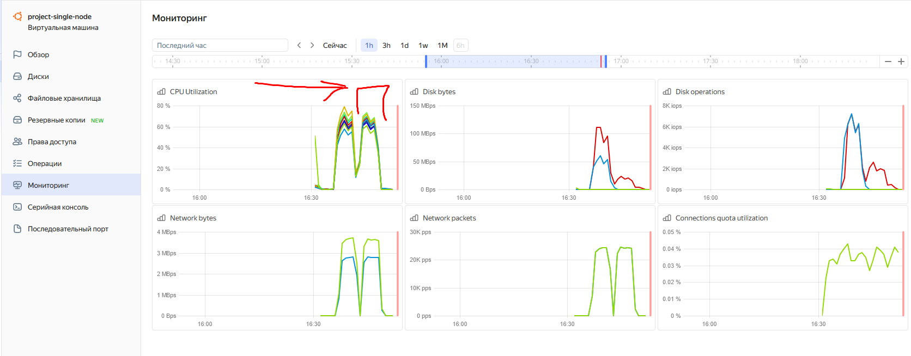

# Тема проекта: Сравнение производительности PostgreSQL в различных архитектурных решениях

## 1. Цели и задачи

Цель данной работы - на практике смоделировать ситуации недостатка различных ресурсов при нагрузке на кластер БД PostgreSQL и сравнить работу различных конфигураций кластера БД PostgreSQL под нагрузкой.

Более наглядный отчет представлен в [презентации](./Презентация%20проекта.%20Сравнение%20производительности%20конфигураций%20PostgreSQL.pdf).

Ниже постараюсь привести дополнительную (по отношению к презентации) информацию по настройке окружения и используемым инструментам.

## 2. Инструменты и настройка окружения

Все измерения в проекте производил на виртуальных машинах в [Yandex Cloud](https://yandex.cloud) с помощью утилиты [pgbench](https://www.postgresql.org/docs/current/pgbench.html).

Использовал **PostgreSQL 15**. В качестве кластера БД с шардированием использовал расширение для [Citus](https://www.citusdata.com/) для **PostgreSQL 15**.

Также использовал [pgbouncer](https://www.pgbouncer.org/) в качестве "пулера" подключений к БД.

Для тюнинга настроек PostgreSQL на каждом из узлов использовал онлайн конфигуратор [www.pgconfig.org](https://www.pgconfig.org) в соответствии с характеристиками виртуальной машины узла.

Для тестирования нагрузки на различных конфигурациях создал на Yandex Cloud 5 виртуальных машин:

|Название|CPU и RAM|Диски|Описание|
|-|-|-|-|
|1. project-loader (IP=192.168.0.5)|8 vCPU + 8ГБ RAM|20ГБ HDD|"нагрузчик", на котором запускал утилиту pgbench, чтобы не занимать ресурсы виртуальной машины кластера БД для чистоты измерений. Также сюда установил по тем же причинам "пулер соединений" pgbouncer для проведения измерений с его использованием|
|2. project-single-node (IP=192.168.0.23)|Настраивал в зависимости от целей измерения от 2 до 16 vCPU и от 4ГБ до 16ГБ RAM|20ГБ SSD для системы и 300ГБ HDD или высокопроизводительного SSD для каталога /var/lib/postgresql в зависимости от целей измерения|виртуальная машина для тестирования работы PostgreSQL в рамках установки на единую машину|
|3. project-citus-coord (IP=192.168.0.24)|Настраивал в зависимости от целей измерения от 2 до 4 vCPU + 4ГБ RAM|20ГБ SSD|узел-координатор для кластера Citus, который не будет хранить данные, но будет распределять нагрузку между шардами project-citus-1 и project-citus-2|
|идентичные машины 4. project-citus-1 (IP=192.168.0.11) и 5. project-citus-2 (IP=192.168.0.16)|2 vCPU + 4ГБ RAM|20ГБ SSD для системы и 300ГБ HDD или высокопроизводительного SSD для каталога /var/lib/postgresql в зависимости от целей измерения|узел-воркер для кластера Citus, который будет обрабатывать часть данных кластера|

> [!NOTE]
> Все установки PostgreSQL производил без дополнительных настроек под отказоустойчивость и восокопроизводительные диски даже использовал [нереплицируемые SSD](https://yandex.cloud/ru/docs/compute/concepts/disk), чтобы снизить стоимость виртуальных машин на время тестирования и обойти ограничения по квотам на реплицируемые высокопроизводительные диски для новых аккаунтов.

Наглядно взаимосвязь виртуальных машин представлена на схеме ниже 

### 2.1 Установка БД на кластер с одной нодой

Согласно [инструкции](../00.Common/01.YC_start.md) создал виртуальную машину **project-single-node**. Версию PostgreSQL для установки выбираем **15**.

Подключал дополнительный диск для каталога `/var/lib/postgresql` в следующем порядке:

1. Разметил подключенный диск на один логический раздел командой `sudo fdisk /dev/vdb`
2. Отформатировал полученный раздел `sudo mkfs.ext4 /dev/vdb1`
3. Подмонтировал диск по временному пути и скопировал текущие данные в него командой `cp -rp /var/lib/postgresql/* /mnt/postgres-data`
4. Прописал подключение нового диска в `/etc/fstab` при загрузке
5. Перезагрузил машину

Для настройки под конкретные характеристики использовал скрипт из онлайн генератора [www.pgconfig.org](https://www.pgconfig.org)

Например, для 2 vCPU + 4ГБ RAM получил скрипт (`max_connections` сознательно выставлял в 200 для тестирования)

```sql
-- Generated by PGConfig 3.1.4 (1fe6d98dedcaad1d0a114617cfd08b4fed1d8a01)
-- https://api.pgconfig.org/v1/tuning/get-config?format=alter_system&include_pgbadger=true&log_format=csvlog&max_connections=100&pg_version=15&environment_name=WEB&total_ram=4GB&cpus=2&drive_type=SSD&arch=x86-64&os_type=linux

-- Memory Configuration
ALTER SYSTEM SET shared_buffers TO '1GB';
ALTER SYSTEM SET effective_cache_size TO '3GB';
ALTER SYSTEM SET work_mem TO '10MB';
ALTER SYSTEM SET maintenance_work_mem TO '205MB';

-- Checkpoint Related Configuration
ALTER SYSTEM SET min_wal_size TO '2GB';
ALTER SYSTEM SET max_wal_size TO '3GB';
ALTER SYSTEM SET checkpoint_completion_target TO '0.9';
ALTER SYSTEM SET wal_buffers TO '-1';

-- Network Related Configuration
ALTER SYSTEM SET listen_addresses TO '*';
ALTER SYSTEM SET max_connections TO '200';

-- Storage Configuration
ALTER SYSTEM SET random_page_cost TO '1.1';
ALTER SYSTEM SET effective_io_concurrency TO '200';

-- Worker Processes Configuration
ALTER SYSTEM SET max_worker_processes TO '8';
ALTER SYSTEM SET max_parallel_workers_per_gather TO '2';
ALTER SYSTEM SET max_parallel_workers TO '2';

-- Logging configuration for pgbadger
ALTER SYSTEM SET logging_collector TO 'on';
ALTER SYSTEM SET log_checkpoints TO 'on';
ALTER SYSTEM SET log_connections TO 'on';
ALTER SYSTEM SET log_disconnections TO 'on';
ALTER SYSTEM SET log_lock_waits TO 'on';
ALTER SYSTEM SET log_temp_files TO '0';
ALTER SYSTEM SET lc_messages TO 'C';

-- Adjust the minimum time to collect the data
ALTER SYSTEM SET log_min_duration_statement TO '10s';
ALTER SYSTEM SET log_autovacuum_min_duration TO '0';

-- CSV Configuration
ALTER SYSTEM SET log_destination TO 'csvlog';
```

Для конфигурации 8 vCPU + 16ГБ RAM (`max_connections` сознательно выставлял в 200 для тестирования)

```sql
-- Memory Configuration
ALTER SYSTEM SET shared_buffers TO '4GB';
ALTER SYSTEM SET effective_cache_size TO '12GB';
ALTER SYSTEM SET work_mem TO '41MB';
ALTER SYSTEM SET maintenance_work_mem TO '819MB';

-- Checkpoint Related Configuration
ALTER SYSTEM SET min_wal_size TO '2GB';
ALTER SYSTEM SET max_wal_size TO '3GB';
ALTER SYSTEM SET checkpoint_completion_target TO '0.9';
ALTER SYSTEM SET wal_buffers TO '-1';

-- Network Related Configuration
ALTER SYSTEM SET listen_addresses TO '*';
ALTER SYSTEM SET max_connections TO '200';

-- Storage Configuration
ALTER SYSTEM SET random_page_cost TO '1.1';
ALTER SYSTEM SET effective_io_concurrency TO '200';

-- Worker Processes Configuration
ALTER SYSTEM SET max_worker_processes TO '8';
ALTER SYSTEM SET max_parallel_workers_per_gather TO '2';
ALTER SYSTEM SET max_parallel_workers TO '2';

-- Logging configuration for pgbadger
ALTER SYSTEM SET logging_collector TO 'on';
ALTER SYSTEM SET log_checkpoints TO 'on';
ALTER SYSTEM SET log_connections TO 'on';
ALTER SYSTEM SET log_disconnections TO 'on';
ALTER SYSTEM SET log_lock_waits TO 'on';
ALTER SYSTEM SET log_temp_files TO '0';
ALTER SYSTEM SET lc_messages TO 'C';

-- Adjust the minimum time to collect the data
ALTER SYSTEM SET log_min_duration_statement TO '10s';
ALTER SYSTEM SET log_autovacuum_min_duration TO '0';

-- CSV Configuration
ALTER SYSTEM SET log_destination TO 'csvlog';
```

С помощью утилиты pgbench (запускал на машине project-loader) сгенерировал 4 БД различного размера под стандартный скрипт командами

|Имя БД|Записей в pgbench_accounts|Команда для генерации|
|-|-|-|
|pgbench_1kk|1 000 000|`export PGPASSWORD=TheStrongPassword123 && pgbench -h 192.168.0.23 -U postgres -i -s 10 pgbench_1kk`|
|pgbench_10kk|10 000 000|`export PGPASSWORD=TheStrongPassword123 && pgbench -h 192.168.0.23 -U postgres -i -s 100 pgbench_10kk`|
|pgbench_100kk|100 000 000|`export PGPASSWORD=TheStrongPassword123 && pgbench -h 192.168.0.23 -U postgres -i -s 1000 pgbench_100kk`|
|pgbench_1kkk|1 000 000 000|`export PGPASSWORD=TheStrongPassword123 && pgbench -h 192.168.0.23 -U postgres -i -s 10000 pgbench_1kkk`|

В сумме все наполненные БД с индексами заняли около 190ГБ места на диске. Если грубо считать, то каждый миллион данных занимает примерно 170МБ.

### 2.2 Установка кластера Citus из 3 узлов

Citus устанавливал на каждый узел согласно инструкции [Multi-Node Citus on Debian or Ubuntu](https://docs.citusdata.com/en/v12.1/installation/multi_node_debian.html).

Отмечу только, что не стоит забывать, что Citus - это extension для PostgreSQL, потому все настройки необходимо делать явно для каждой БД, в которой планируется использовать его возможности.

В планах было шардировать все таблицы по полю bid (идентификатор для pgbench_branches). Потому пришлось несколько скорректировать исходный скрипт для создания БД и дополнить его созданием уникальных ключей с bid во всех таблицах (одно из требований для шардирования) и добавить уникальный автогенерируемый столбец-идентификатор к таблице pgbench_history. Получился следующий скрипт

```sql
create table if not exists pgbench_history  
(  
    hid    integer not null generated always as identity,
    tid    integer,  
    bid    integer,  
    aid    integer,  
    delta  integer,  
    mtime  timestamp,  
    filler char(22),

    PRIMARY KEY (bid, hid)
);  
  
alter table pgbench_history  
    owner to postgres;  
  
create table if not exists pgbench_tellers  
(  
    tid      integer not null,  
    bid      integer,  
    tbalance integer,  
    filler   char(84),
    
    PRIMARY KEY (bid, tid)
)  
    with (fillfactor = 100);  
  
alter table pgbench_tellers  
    owner to postgres;  
  
create table if not exists pgbench_accounts  
(  
    aid      integer not null,  
    bid      integer,  
    abalance integer,  
    filler   char(84),

    PRIMARY KEY (bid, aid)
)  
    with (fillfactor = 100);  
  
alter table pgbench_accounts  
    owner to postgres;  
  
create table if not exists pgbench_branches  
(  
    bid      integer not null  
        primary key,  
    bbalance integer,  
    filler   char(88)
)  
    with (fillfactor = 100);  
  
alter table pgbench_branches  
    owner to postgres;

SELECT create_distributed_table('pgbench_history',  'bid');
SELECT create_distributed_table('pgbench_tellers',  'bid');
SELECT create_distributed_table('pgbench_accounts', 'bid');
SELECT create_distributed_table('pgbench_branches', 'bid');
```

Как и в пункте 2.2 создал 4 БД с разным количеством данных (наполнял так же утилитой pgbench с пропуском стадии генерации таблиц)

|Имя БД|Записей в pgbench_accounts|Команда для генерации данных|
|-|-|-|
|pgbench_1kk|1 000 000|`export PGPASSWORD=TheStrongPassword123 && pgbench -h 192.168.0.24 -U postgres -i -I g -s 10 pgbench_1kk`|
|pgbench_10kk|10 000 000|`export PGPASSWORD=TheStrongPassword123 && pgbench -h 192.168.0.24 -U postgres -i -I g -s 100 pgbench_10kk`|
|pgbench_100kk|100 000 000|`export PGPASSWORD=TheStrongPassword123 && pgbench -h 192.168.0.24 -U postgres -i -I g -s 1000 pgbench_100kk`|
|pgbench_1kkk|1 000 000 000|`export PGPASSWORD=TheStrongPassword123 && pgbench -h 192.168.0.24 -U postgres -i -I g -s 10000 pgbench_1kkk`|

Для нагрузки pgbench так же была необходимость изменить встроенный скрипт и дополнить его данными о bid в каждом запросе (чтобы Citus мог сразу определить запрос на конкретный узел)

```sql
\set bid random(1, 1 * :scale)
\set aid ((:bid - 1) * 100000 + random(1, 100000))
\set tid random(10 * :bid - 9, 10 * :bid)
\set delta random(-5000, 5000)
BEGIN;
UPDATE pgbench_accounts SET abalance = abalance + :delta WHERE aid = :aid AND bid = :bid;
SELECT abalance FROM pgbench_accounts WHERE aid = :aid AND bid = :bid;
UPDATE pgbench_tellers SET tbalance = tbalance + :delta WHERE tid = :tid AND bid = :bid;
UPDATE pgbench_branches SET bbalance = bbalance + :delta WHERE bid = :bid;
INSERT INTO pgbench_history (tid, bid, aid, delta, mtime) VALUES (:tid, :bid, :aid, :delta, CURRENT_TIMESTAMP);
END;
```

В итоге запускал нагрузку командой вида (важно отметить, что т.к. скрипт кастомный, то была необходимость явно передавать ключ `-s <Scale Factor>` при каждом запуске)

```bash
export PGPASSWORD=TheStrongPassword123 && pgbench -h 192.168.0.24 -U postgres -j 8 -c 32 -T 300 -P 30 pgbench_1kkk -f pgbench_citus.sql -s 10000
```

### 2.3 Установка ПО на узел для запуска pbgench

Для узла project-loader cогласно [инструкции](../00.Common/01.YC_start.md) создал виртуальную машину **project-lader** с версией PostgreSQL для установки **15**.

Также установил на этот узел пулер соединений pgbouncer согласно инструкии [pgbouncer tutorial](https://www.scaleway.com/en/docs/tutorials/install-pgbouncer/) с примерными шагами

**1. Установка пакета.**

```bash
sudo  apt install pgbouncer -y
```

**2. Правка конфигурации.**

Подправил файл `/etc/pgbouncer/pgbouncer.ini` и выставил максимальное количество подключений к БД в 24 (это число вывел эмпирически при сравнении результатов tps под нагрузкой заданного характера TPC-B)

```ini
[databases]
* = host=192.168.0.23 port=5432 pool_mode=transaction max_db_connections=24

[pgbouncer]
;; any, trust, plain, md5, cert, hba, pam
auth_type = hba
auth_file = /etc/pgbouncer/userlist.txt

;; Path to HBA-style auth config
auth_hba_file = /etc/pgbouncer/pb_hba.conf
```

Создал файл `/etc/pgbouncer/pb_hba.conf` с возможностью подключения локально

```config
# TYPE DATABASE USER ADDRESS METHOD
# IPv4 local connections:
host all all 127.0.0.1/32 scram-sha-256
# IPv6 local connections:
host all all ::1/128 scram-sha-256
# Application
# host all all APPLICATION_IP/NETMASK scram-sha-256
```

Подправил `/etc/pgbouncer/userlist.txt` (пароль взял из БД на узле project-single-node через `SELECT usename,passwd FROM pg_shadow;`)

```config
"postgres" "SCRAM-SHA-256$4096:1k9vb8kGpmkaCMSemXrpcw==$ux8+/lS24FiV2UvOnslnTfGM7vr298IG9uWeFEQUnqo=:i4JCgrtz4lJIDhy4+a7glxFCaStHub8pYfsQyP58/Hk="
```

**3. Перезапуск сервиса pgbouncer.**

```bash
sudo systemctl reload pgbouncer.service
```

В итоге при подключении под адресу localhost:6432 была возможность подключаться через pgbouncer к узлу **project-single-node** и давать нагрузку туда командой вида

```bash
 export PGPASSWORD=TheStrongPassword123 && pgbench -h localhost -p 6432 -U postgres -j 8 -c 96 -T 300 -P 30 pgbench_1kkk
```

## 3. Результаты измерений

Результаты измерений представлены в виде табличек, где первым столбцом идет имя БД и узел, на котором производилась нагрузка, а дальше по одному столбцу на количество клиентов, которые создавались при нагрузке с использованием pgbench.

|Пример БД и узла|Описание|
|-|-|
|1kkk single|БД на 1 миллиард записей на кластере с единым узлом|
|100kk citus|БД на 100 миллионов записей на кластере Citus. В этой строке будет значение tps для кластера и картинка с мониторингом для узла-координатора|
|worker 1 citus|В этой строке будет картинка с мониторингом для узла-воркера в кластере Citus под номером 1 для нагрузки на БД строкой выше|
|worker 2 citus|В этой строке будет картинка с мониторингом для узла-воркера в кластере Citus под номером 2 для нагрузки на БД двумя строками выше|

К сожалению, некоторые скриншоты мониторинга пропущены - их я потерял в ходе работы и не успел повторить измерения.

Практически на всех графиках мониторинга следует смотреть на последний "горб" нагрузки. Иногда нужный промежуток времени для графиков выделен красной линией (если это кластер citus - то на части скрина с нагрузкой на CPU для координатора; на кластере с единым узлом - на части скрина с нагрузкой на CPU).

### 3.1 Узкое место - процессор

В данном эксперименте настроил хранение данных PostgreSQL на всех узлах (project-single-node, project-citus-1, project-citus-2) на использование высокопроизводительного нереплицируемого SSD со следующими характеристиками


При этом провел эксперимент на двух конфигурациях узлов (project-single-node, project-citus-coord, project-citus-1, project-citus-2) в части количества vCPU и RAM. Эти конфигурации указаны в заголовках ниже.

#### 2 vCPU и 4GM RAM

|             | 24 \| tps + monitoring| 64 \| tps + monitoring|
| ----------- | --------- | --------- |
| 1kkk single | 1 298 | 1 415  |
| 1kkk citus  | 825  | 767 |
| worker 1 citus |||
| worker 2 citus |||

Видим, что при таком типе нагрузки, когда сами запросы очень легкие, и процессор забит скорее количеством запросов и "инфраструктурной" нагрузкой на их обслуживание, а не долгой обработкой каждого из них, кластер Citus на машинах, где у каждого узла характеристики сопоставимые с кластером с единым узлом, значительно проигрывает в скорости обработки запросов единому узлу.

#### 4 vCPU и 4GM RAM

Попробуем увеличить количество процессоров на каждом из узлов и посмотреть изменится ли картина.

||96 \| tps + monitoring|96 \| tps + monitoring|
|---|---|---|
|1kkk single|3 405 |13 826|
|1kkk citus|1 885 |4 306 |
|worker 1 citus|||
|worker 2 citus|||

Как видим, картина по пропускной способности не поменялась и кластер Citus с шардированием всё так же проигрывает кластеру на едином узле. Думаю, картина поменяется, если изменить характер нагрузки на TPC-C, где среди нагрузочных транзакций будут встречаться запросы требовательные к вычислительным ресурсам процессора, однако наверняка протестировать этот момент я не успел.

### 3.2 Узкое место - диск

В данном эксперименте настроил все машины (project-single-node, project-citus-coord, project-citus-1, project-citus-2) на использование 2 vCPU и 4GM RAM и на использование сетевых HDD дисков для хранения данных PostgreSQL. Характеристики используемых дисков следующие


||32 \| tps + monitoring|64 \| tps + monitoring|72 \| tps + monitoring|
|---|---|---|---|
|100kk single|324 |334 |357 |
|100kk citus|258 |546 |471 |
|worker 1||||
|worker 2||||

В данном сравнении видим, что картина стала более выгодной в пользу Citus с шардированием, т.к. пропускной способности узла-координатора хватает, чтобы передать весь поток запросов на сторону шардов и нагрузка идёт уже не на один диск, но сразу на два, что значительно увеличивает пропускную способность обработки запросов при необходимости чтения с и записи на диск.

### 3.3 Зависимость нагрузки от размеров БД

В данном эксперименте попробовал изучить зависимость нагрузки от размера БД и сравнивал под различным количеством клиентов пропускную способность для двух БД: размером в один миллион записей и в один миллиард записей. Замеры для других двух БД (на 10 миллионов записей и на 100 миллионов записей), к сожалению, пока провести не успел.

Для измерения использовал кластер на одном узле (project-single-node) с быстрыми дисками SSD, 8 vCPU и 16ГБ RAM


||24 \| tps + monitoring|64 \| tps + monitoring|96 \| tps + monitoring|
|---|---|---|---|
|1kkk single|3 401 |4 652 |4 746 |
|1kk single|3 471 |3 670 |3 794 |

В данном эксперименте выявилась подозрительная особенность, что БД меньшего размера показывала значительно меньшую пропускную способность. Всё дело оказалось в блокировках из-за особенностей наполнения БД и скрипта нагрузки.

Так на каждые 100 000 акканутов (таблица `pgbench_accounts`) в БД генерируется по 1 записи департамента (таблица `pgbench_branches`). Получается, что в БД 1kkk будет 1 000 департаментов, а в БД 1kk - всего 10. При этом стандартный скрипт для транзакции нагрузки приведенный ниже содержит команду на обновление записи департамента в том числе

```sql
\set aid random(1, 100000 * :scale)
\set bid random(1, 1 * :scale)
\set tid random(1, 10 * :scale)
\set delta random(-5000, 5000)
BEGIN;
UPDATE pgbench_accounts SET abalance = abalance + :delta WHERE aid = :aid;
SELECT abalance FROM pgbench_accounts WHERE aid = :aid;
UPDATE pgbench_tellers SET tbalance = tbalance + :delta WHERE tid = :tid;
UPDATE pgbench_branches SET bbalance = bbalance + :delta WHERE bid = :bid; -- ЗДЕСЬ ВОЗНИКАЛО НАИБОЛЬШЕЕ КОЛИЧЕСТВО БЛОКИРОВОК
INSERT INTO pgbench_history (tid, bid, aid, delta, mtime) VALUES (:tid, :bid, :aid, :delta, CURRENT_TIMESTAMP);
END;
```

Удалось это выяснить после анализа запроса к преставлению блокировок

```sql
SELECT *
FROM pg_locks pl
    LEFT JOIN pg_stat_activity psa ON pl.pid = psa.pid;
```

Так во время нагрузки на БД 1kkk (один миллиард записей) значение активных блокировок колебалось в районе 200. Во время аналогичного измерения для БД 1kk (миллион записей) среднее значение вырастало до 900-1000.

Измерений без команды на обновление департаментов для сравнения, к сожалению, провести не успел.

### 3.4 Когда начнет приносить пользу пулер соединений

В данном эксперименте попробовал посмотреть есть ли необходимость в пулере соединений на постоянном количестве соединений с размером 100 активных соединений. Для этого попробовал сначала найти тот предел значения количества активных сессий в pgbench, на котором tps начинал уменьшаться. Затем для такого количества максимальных подключений к БД настроил pgbouncer в качестве пулера подключений и проверил пропускную способность конфигурации на 96 активных сессиях в pgbench.

Для измерения использовал кластер на одном узле (project-single-node) с быстрым диском SSD, 2 vCPU и 4ГБ RAM


||   |16 \| tps|24 \| tps|64 \| tps|96 \| tps|
|---|---|---|---|---|---|
|прямое подключение|1kkk single|1 379|1 366|1 320|1 279|
|прямое подключение|1kk single|1 531|1 685|1 477|1 271|
|pgbouncer на 24 подключения|1kkk single||||1 424|
|pgbouncer на 24 подключения|1kk single||||1 649|

В итоге блокером для увеличения tps в данной конфигурации становились ресурсы процессора. Он был загружен на 100%, а диски были далеки от своих лимитов загрузки. Наибольшее количество tps без пулера я получил на 24 подключениях, потому выставил настройку pgbouncer именно на это значение. И с такой конфигурацией пропускная способность при нагрузке pgbench с 96 активными сессиями через pgbouncer ожидаемо восстановилась до варианта, когда мы запускали pgbench на 24 активных сессии, хотя время обработки отдельной транзакции, разумеется, возросло, т.к. некоторое время транзакции ожидали в очереди pgbouncerа.

## 4. Краткие выводы и возможные направления развития проекта

Из выводов:

1. Ситуация с экспериментом, где на более маленькой БД блокировки значительно снизили быстродействие относительно большой БД показала, что наличие детального мониторинга может помочь быстрее разобраться в проблеме и принять правильные решения по настройке параметров СУБД и подсказать пути решения проблемы
2. Также несколько неожиданно для меня оказалось, что польза от использования connection pooler видна уже на самых небольших нагрузках.

Возможные направления развития:

1. Проверить поможет ли секционирование по разным тейблспейсам обойти ограничение по диску (не будем ли упираться в диск для wal сильно быстро)
2. Попробовать нагрузку с TCP-C с более сложными запросами на процессор при сравнении с citus
3. Настроить для тестирования более детальный мониторинг (с информацией о внутренних операциях СУБД, по типу блокировок)
4. Сравнение PostgreSQL с MS SQL на сопоставимых нагрузках
